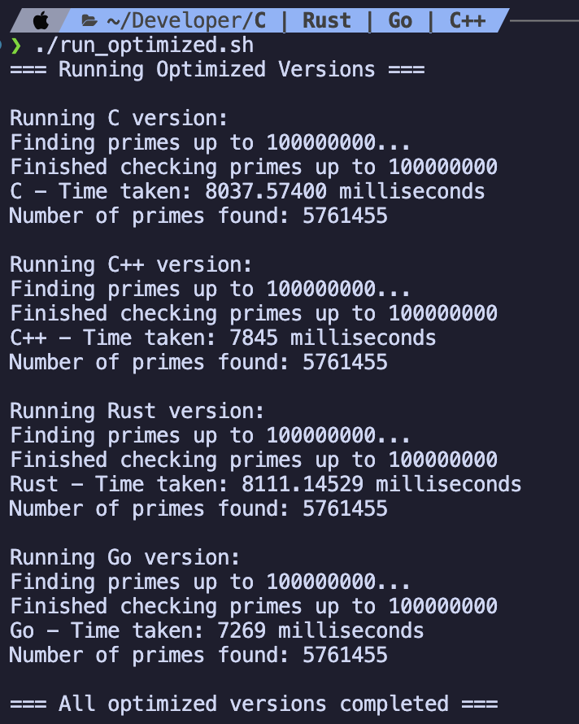

# Prime Number Calculator Performance Comparison

This project implements a simple prime number calculator in multiple programming languages to compare their performance. The program counts prime numbers and measures the execution time.

## Last run



## Implementations

The same algorithm is implemented in:
- C (`time_test.c`)
- C++ (`time_test.cpp`)
- Rust (`time_test.rs`)
- Go (`timeprimes.go`)

Each implementation:
- Uses the same optimized prime-checking algorithm with wheel factorization
- Reports execution time in milliseconds
- Reports the total count of prime numbers found

## Performance Comparison

The project includes scripts to compare performance across implementations:
- `run_all.sh`: Runs standard builds of all versions
- `run_optimized.sh`: Runs highly optimized builds
- `build_optimized.sh`: Creates optimized binaries

### Output Format
Each implementation outputs in a consistent format:
```
Time taken: X.XXX milliseconds
Found Y prime numbers
```

Where:
- X.XXX is the execution time in milliseconds
- Y is the total count of prime numbers found

## Building and Running

### Prerequisites
- GCC (for C)
- G++ (for C++)
- Rust compiler
- Go compiler

### Quick Start
1. Build optimized versions:
   ```bash
   ./build_optimized.sh
   ```
2. Run performance comparison:
   ```bash
   ./run_optimized.sh
   ```

### Build Options

#### Regular Build
To compile and run all versions with standard optimizations:
```bash
./run_all.sh
```

#### Optimized Build
To compile highly optimized versions with advanced compiler flags:
```bash
./build_optimized.sh
```

This creates the following optimized binaries:
- `time_test_c_opt` (C version)
- `time_test_cpp_opt` (C++ version)
- `time_test_rust_opt` (Rust version)
- `timeprimes_opt` (Go version)

To run just the optimized versions:
```bash
./run_optimized.sh
```

### Individual Build Commands

#### Standard Build Commands
C version:
```bash
gcc -O3 time_test.c -o time_test_c_release -lm && ./time_test_c_release
```

C++ version:
```bash
g++ -std=c++11 -O3 time_test.cpp -o time_test_cpp_release && ./time_test_cpp_release
```

Rust version:
```bash
rustc -O time_test.rs -o time_test_rust_release && ./time_test_rust_release
```

Go version:
```bash
go run timeprimes.go
```

#### Optimized Build Commands
C version:
```bash
gcc -O3 -march=native -flto time_test.c -o time_test_c_opt -lm
```

C++ version:
```bash
g++ -O3 -march=native -flto -std=c++11 time_test.cpp -o time_test_cpp_opt
```

Rust version:
```bash
rustc -C opt-level=3 -C target-cpu=native -C lto time_test.rs -o time_test_rust_opt
```

Go version:
```bash
go build -ldflags="-s -w" -o timeprimes_opt timeprimes.go
```

## Compiler Optimization Flags

The optimized builds use several advanced compiler flags:

### C/C++
- `-O3`: Maximum optimization level
- `-march=native`: Optimize for the current CPU architecture
- `-flto`: Enable Link Time Optimization

### Rust
- `-C opt-level=3`: Maximum optimization level
- `-C target-cpu=native`: CPU-specific optimizations
- `-C lto`: Link Time Optimization

### Go
- `-ldflags="-s -w"`: Strip debugging information

## Project Structure
```
├── build_optimized.sh     # Script to build optimized versions
├── run_all.sh            # Script to run all standard versions
├── run_optimized.sh      # Script to run optimized versions
├── time_test.c           # C implementation
├── time_test.cpp         # C++ implementation
├── time_test.rs          # Rust implementation
└── timeprimes.go         # Go implementation
```

## Performance Results

To view performance comparison between implementations:
1. Build the optimized versions using `./build_optimized.sh`
2. Run `./run_optimized.sh` to see timing results
3. Each implementation will report its execution time and prime number count

The results are displayed in a clear format showing the time taken by each implementation, making it easy to compare performance across languages.